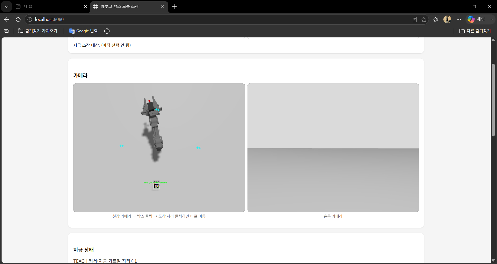
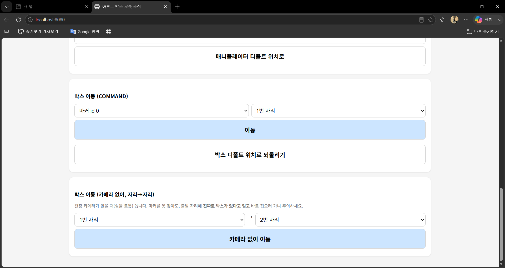
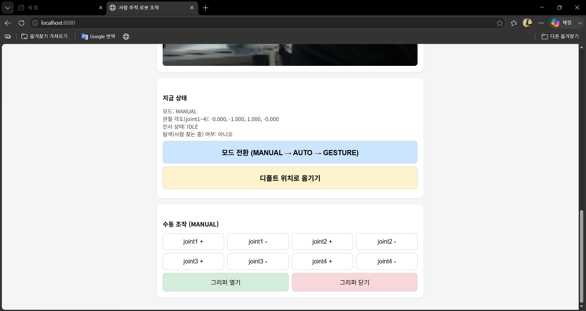
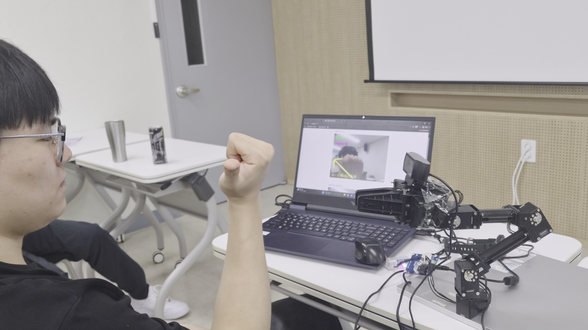
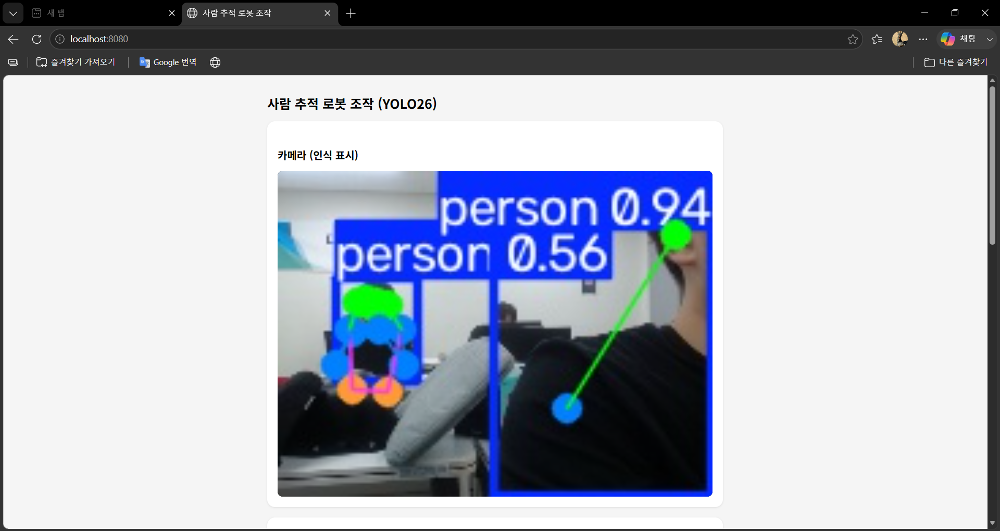
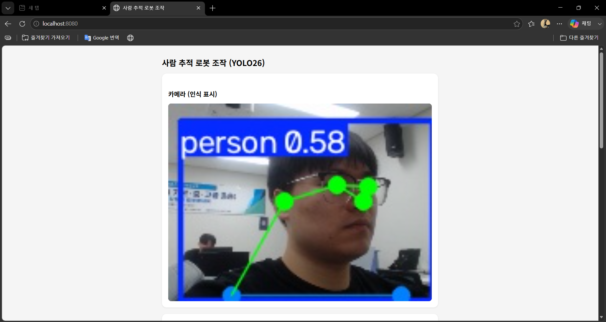
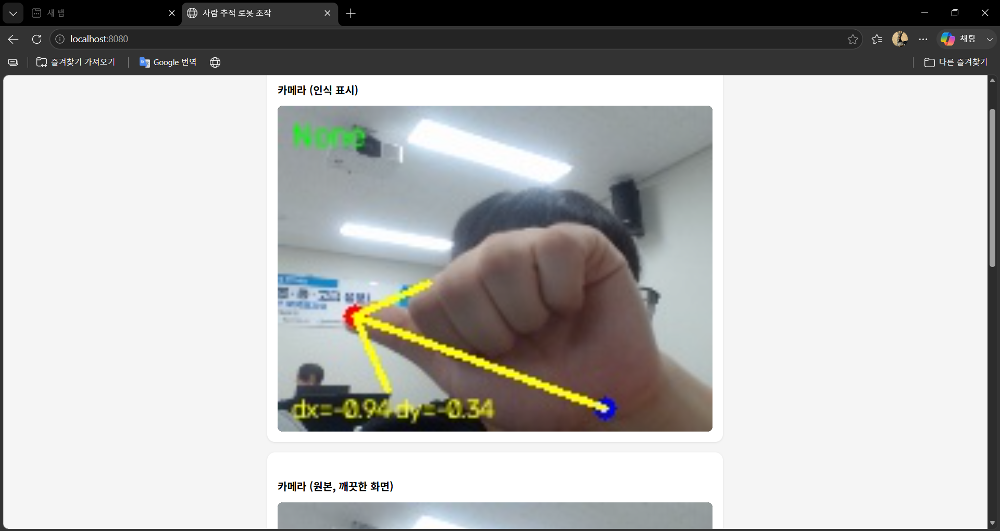
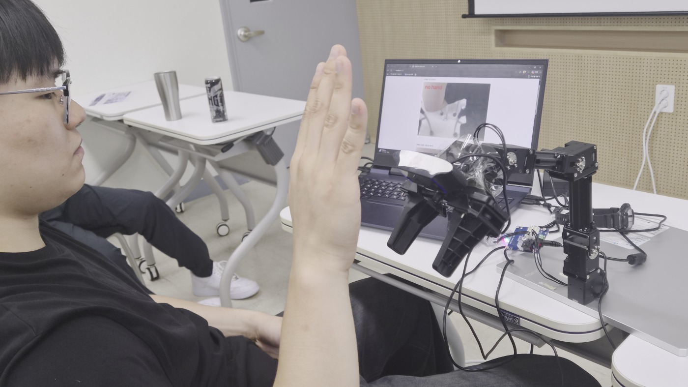

# 카메라 기반 매니퓰레이터 자동화 프로젝트 보고서

> 빨간 공 추적 · 아루코 박스 자리 정리 · YOLO 사람 추적
> 대상 패키지: `ros_ws/src/이서현_projectGazebo`(ROS2 패키지명 `redball_sort_project`), `ros_ws/src/이서현_projectYOLO`(ROS2 패키지명 `person_follow_project`)
> 작업 기간: 2026-08-10 ~ 2026-08-13
> 환경: ROS2 Jazzy, Gazebo(gz sim), OpenManipulator-X(4자유도 팔 + 그리퍼), WSL2

---

## 1. 프로젝트 개요

이 프로젝트는 카메라로 인식한 대상(빨간 공 → 아루코 마커 박스 → 사람)을 향해 OpenManipulator-X 로봇 팔이 스스로 움직이도록 만드는 작업을, 난이도를 높여가며 3단계로 진행한 것이다.

| 단계 | 이름 | 무엇을 인식하나 | 무엇을 하나 |
|---|---|---|---|
| 1단계 | 빨간 공 추적 | 색상(HSV) | 공을 화면 중심에 맞추며 쫓아가 그리퍼로 잡기 |
| 2단계 | 아루코 박스 자리 정리 | 아루코 마커(ArUco) | 박스를 매니퓰레이터 주변 8개 자리끼리 옮기기 |
| 3단계 | YOLO 사람 추적 | AI 객체/포즈 인식(YOLO26) | 사람에게 다가가 인사, 실물 로봇 + 손동작 제어로 확장 |

세 단계 모두 같은 뼈대(MANUAL/AUTO 키보드 조작, ROS2 액션 기반 팔 제어)를 재사용하면서 인식 방식과 제어 로직만 발전시키는 방식으로 만들어졌다. 두 프로젝트는 서로 다른 ROS2 패키지(`redball_sort_project`, `person_follow_project`)로 분리되어 있으며, 아래 두 워크스페이스를 함께 사용한다.

- `~/kongju_manipulator_2026/ros_ws/` — 이 git 저장소. 실제 작성한 코드가 위치.
- `~/open_manipulator_ws/` — 이 저장소 밖, ROBOTIS가 제공하는 로봇 팔 description/bringup 패키지. 카메라 센서, 컨트롤러 설정 등 하드웨어 관련 파일이 위치.

---

## 2. 1단계 — 빨간 공 추적 (`redball_tracking_project.py`)

### 2.1 배경 및 목표

수업용 예제 파일(`camera_opencv/find_redball.py`)에는 "카메라로 빨간 공을 찾아 화면에 박스를 그리는" `image_callback` 부분까지만 구현되어 있었고, 그 아래에는 "이 좌표로 팔을 움직이세요"라는 힌트 주석만 남아 있었다. 이 프로젝트는 그 나머지 절반, 즉 **실제로 팔을 움직이고 공을 잡는 로직**을 `redball_tracking_project.py`라는 새 파일로 채운 것이다. 원본 파일은 수정하지 않았다.

### 2.2 구현 내용

- **공 인식**: HSV 색공간에서 빨간색 마스크를 만들어 공의 중심 좌표와 면적(거리 지표)을 계산. 원본 대비 개선한 점:
  - 빨간색은 Hue 값 0 근처와 180 근처 양 끝에 걸쳐 있는데, 원본은 0~10 구간만 봤음 → 170~180 구간을 추가.
  - 원본이 `cv2.boundingRect()`의 반환 순서를 `x, y, h, w`로 잘못 가정하고 있던 것을 `x, y, w, h`로 수정.
  - 카메라 콜백이 초당 수십 번 호출되므로, 이전 팔 이동 목표(action goal)의 응답이 오기 전엔 새 목표를 보내지 않도록 하는 `arm_goal_in_progress` 플래그를 추가(과도한 목표 누적으로 팔이 끊기듯 움직이는 것 방지).
- **조작 모드**: 실행 직후 항상 **MANUAL(수동) 모드**로 시작(안전을 위한 설계). 키보드(`q/a/w/s/e/d/r/f`)로 관절을 하나씩 조작할 수 있고, `m`을 누르면 **AUTO(자동) 모드**로 전환되어 카메라가 공을 보고 스스로 따라간다. `z`/`x`는 그리퍼 열기/닫기.
- **자동 추적 로직**: 화면 중심과 공 중심의 오차를 계산 → `joint1`(좌우), `joint2~4`(상하)를 오차에 비례해 조금씩(`MAX_STEP` 제한) 이동 → 공 면적이 `GRAB_AREA`보다 커지면(충분히 가까워지면) 그리퍼를 한 번 닫아 잡는다.

### 2.3 시뮬레이션 환경 구축 중 겪은 문제

1. **가상 세계에 "빨간 공"이 존재하지 않음**: `models/red_ball/`에 공의 3D 모델(반지름 2cm, 질량 50g, 마찰 계수 등)을 새로 제작하고, world 파일에 `<include>`로 등록.
2. **카메라 화면이 계속 나오지 않음**: 원인이 3곳에 걸쳐 있었다.
   - world 파일에 `gz::sim::systems::Sensors` 렌더링 플러그인이 빠져 있었음(카메라 센서 자체가 렌더링되지 않음).
   - `ros_gz_bridge` 설정에 `/gripper_camera/image_raw`, `/gripper_camera/camera_info` 토픽이 등록되어 있지 않아 Gazebo↔ROS2 통역이 안 되고 있었음.
   - 로봇 모델(URDF/xacro)에 카메라 센서 자체가 정의되어 있지 않았음.
   - 세 곳 모두 원래 체크리스트(`Add_camera.md`)에 방법이 적혀 있었지만 실제로 적용이 안 된 상태였고, 이번에 확인하며 마저 적용함.
3. **GPU 렌더링 문제**: `LIBGL_ALWAYS_SOFTWARE=1` 설정이 켜져 있어 CPU 소프트웨어 렌더링으로 동작해 매우 느렸음. 이 설정을 끄니 GPU(D3D12 경유 NVIDIA)를 정상적으로 사용해 훨씬 부드럽게 동작. (`MESA: ZINK: failed to choose pdev` 로그는 무해한 경고로, 자동으로 GPU 드라이버로 전환됨.)
4. **팔 기본 자세에서 카메라가 가까운 바닥을 못 봄**: 팔이 기본 자세(모든 관절 ≈ 0)일 때 카메라는 거의 수평으로 먼 곳을 봐서, 앞 약 55cm 이내 바닥은 화면 밖으로 벗어남. 해결책 2가지: (1) MANUAL 모드로 팔을 살짝 숙여 카메라가 가까운 곳을 보게 하거나, (2) 공을 카메라가 보이는 위치(약 1m 앞)로 옮김.
5. **팔이 바닥 쪽으로 향한 아찔한 순간**: 관절 값을 감으로 크게 보냈다가 팔이 점점 바닥으로 내려가는 상황을 겪음. 바닥에 닿기 전 되돌려 문제는 없었으나, 이후 "관절 값을 감으로 보내지 않는다"는 원칙을 세우는 계기가 됨(아래 4단계 버그 섹션 및 프로젝트 공통 원칙 참고).

---

## 3. 2단계 — 아루코 박스 자리 정리 (`box_sort_project.py`)

### 3.1 설계 변경

원래는 "색깔별로 분류함에 넣기"를 목표로 잡았으나, **"매니퓰레이터 주변을 8방향 자리로 나누고, 그 자리끼리 박스를 옮기는" 방식**으로 변경했다. 색 대신 "몇 번 자리"로 물건을 구분하는 방식이다(예: "1번 자리 박스를 7번 자리로 옮겨").

### 3.2 두 가지 조작 모드

- **TEACH 모드**: `n`/`b`로 "지금 가르칠 자리 번호" 커서를 옮기고, 팔을 원하는 자세로 움직인 뒤 `g`로 저장. `config/box_slots.yaml`에 즉시 기록된다.
- **COMMAND 모드**: `c`로 진입해 `"마커id 도착자리"`(예: `0 3`)를 입력하면, 그리퍼 열기 → 출발 자리로 이동 → 집기 → 도착 자리로 이동 → 놓기를 자동 수행한다. 출발 자리는 사람이 몰라도 되며, 천장 카메라가 실시간으로 찾는다.

### 3.3 자리를 자동으로 안전하게 채운 방법 (TF 기반 실측 탐색)

24개(이후 8개로 단순화, 아래 3.6 참고) 자리를 사람이 일일이 손으로 가르치는 대신, 다음과 같은 절차로 안전하게 자동 확보했다.

1. 후보 관절값으로 팔을 움직인 뒤, `tf2_ros`로 `world → end_effector_link`의 **실측 3D 좌표**를 매번 조회(계산이 아닌 시뮬레이터 실측값).
2. 높이(z)가 안전선 아래로 내려가면 즉시 그 자세를 버리고 이전 값을 유지.
3. `joint1`(허리 회전)은 반지름/높이에 영향을 주지 않는 순수 Z축 회전이라는 점을 이용해, 방향별로 반복 탐색하지 않고 거리별 자세 하나만 검증한 뒤 여러 방향에 복사해서 전체를 채움.
4. 여러 각도에서 반지름/높이가 실제로 동일하게 유지되는지 재검증 후 전체 생성 및 저장.

### 3.4 카메라 / 아루코 인식

- **손목(그리퍼) 카메라**: `/gripper_camera/image_raw`를 구독해 매 프레임 `cv2.aruco.detectMarkers`로 마커(`DICT_4X4_50`)를 찾아 테두리·좌표축·거리(m)를 화면에 표시. 카메라 SDF의 시야각(60°)과 해상도(640×480)로부터 핀홀 카메라 모델 공식을 역산한 근사 카메라 행렬로 거리를 추정(정밀 캘리브레이션은 아님).
  - **흥미로운 발견**: 마커가 박스 윗면에 있어, 팔이 정면(수평)을 볼 때는 거의 안 보이고, 그리퍼가 위에서 아래로 내려가는 자세일 때만 정면으로 내려다보게 되어 정상 인식됨(실측: "id=0, 거리≈0.156m").
- **천장(오버헤드) 고정 카메라**: 작업공간 전체를 위에서 내려다보는 두 번째 카메라를 world 파일에 독립된 정적(static) 모델로 추가. 손목 카메라가 "손 앞을 보는 눈"이라면, 천장 카메라는 "작업 공간 전체를 보는 눈"이다. 이 카메라 덕분에:
  - "몇 번 박스"인지 몰라도 "0번 박스를 3번 자리로 옮겨"처럼 마커 id만으로 명령 가능(출발 자리를 자동으로 찾음).
  - 이미 다른 박스가 있는 자리로는 이동을 자동 차단(디바운스 처리 포함, 순간 오검출로 안전장치가 무력화되는 것 방지).

*웹 대시보드의 천장 카메라 · 손목 카메라 듀얼 화면. 천장 카메라 쪽에 자리 번호(+1~+4)와 인식된 박스(id=1, slot=3)가 함께 표시된다.*

### 3.5 검증 중 발견하고 고친 심각한 버그 4개 + 추가 버그

"진짜 다 확인한 거 맞냐"는 질문을 계기로 실제 팔을 움직여 검증한 결과, **팔이 지금까지 한 번도 제대로 움직인 적이 없었다**는 사실이 드러났다.

| # | 버그 | 원인 | 해결 |
|---|---|---|---|
| 1 | 관절 값 순서 착각 | `/joint_states` 메시지가 `[gripper_left, gripper_right, joint1~4]` 순서인데 그대로 순서대로 읽어 그리퍼 값을 joint1로 착각 | `msg.name`으로 이름 매칭해서 순서를 재구성 |
| 2 | 관절 이름 4개 vs 좌표 6개 | 버그 1의 여파로 목표 좌표 개수가 관절 이름 개수와 불일치 | 버그 1 수정으로 자동 해결 |
| 3 | 목표 거절 시 영원히 "대기 중" | `goal_handle.accepted` 확인 없이 바로 결과를 기다려서, 거절되면 진행 플래그가 계속 `True`로 남음 | 거절 시 즉시 플래그 해제 |
| 4 | 시뮬레이션 시간 vs 실제 시간 불일치 | `header.stamp`에 wall-clock 시각을 채웠는데 Gazebo 컨트롤러는 `use_sim_time`을 사용 → 두 시계가 안 맞아 무한 대기 | `header.stamp`를 채우지 않음(기본값 0 = 즉시 시작) |
| 5 | "성공" 로그가 실제 실패를 가림 | 그리퍼가 물체에 막히면 실패(ABORTED)로 처리하는 기본 설정, `FollowJointTrajectory`가 SUCCEEDED를 반환해도 실제 각도는 목표에 못 미친 채 멈추는 경우 존재 | `allow_stalling: true` 설정, 목표-실제값 확인 후 오차만큼 보정 재전송(최대 3회) 로직(`_move_and_wait`) 추가 |

버그 4개(1~4)를 고친 뒤 `run_command(1, 2)`를 실제로 호출해 그리퍼 열기 → 이동 → 집기 → 이동 → 놓기가 4.9~8.3초 만에 성공 로그와 함께 끝나는 것을 확인했다. 그러나 **좌표로 재검증한 결과, 로그상의 "성공"이 실제로는 아무것도 옮기지 못한 거짓 성공이었음**을 추가로 발견했다(아래).

### 3.6 "로그는 성공, 실제로는 실패"를 좌표로 검증하며 발견한 문제들

박스의 실제 월드 좌표를 이동 전/후로 비교(`gz topic -e -t /world/.../pose/info`)해서만 발견할 수 있었던 조용한 실패들:

1. **그리퍼가 물체에 막히면 실패로 오판**: 기본 설정(`allow_stalling: false`)에서는 손이 끝까지 안 오므라들면 무조건 실패 처리. `allow_stalling: true`로 변경해 "막히면 = 잡은 것"으로 정상화.
2. **박스를 쥔 채 몸통을 돌리면 바닥 마찰에 빠짐**: 박스가 바닥에 붙은 채로 회전하면 마찰이 그립보다 세서 빠짐 → "집기 → 살짝 들어올리기 → 회전 → 내려놓기" 3단계 경로로 변경.
3. **접근 경로 중 박스를 미리 건드림**: 경로 중간에 손이 낮게 스치며 박스를 건드린 상태에서 그리퍼를 닫아 30cm 넘게 튕겨나간 사례 발생 → 위에서 아래로 내려가는 접근 방식으로 변경.
4. **시스템 부하로 인한 오탐 타임아웃**: 컴퓨터가 바쁠 때 실제로는 도착했는데 응답이 늦게 와 타임아웃(실패)으로 오판 → 대기 시간을 여유 있게 늘림.

이 네 가지를 모두 고친 뒤 1번↔2번 자리 왕복 이동을 좌표까지 직접 확인해 연속 성공시켰다. 검증 부담을 낮추기 위해 자리 개수를 우선 2개로 줄였다가, 이후 박스 2개 + 자리 4개로 확장하며 아래 문제들을 추가로 해결했다.

5. **천장 카메라 화면비 문제**: 자리 하나가 화면 가장자리에 걸려 안 보임 → 시야각을 넓히니 마커가 너무 작아짐 → 해상도를 2배로 올려 해결.
6. **로봇 대기 자세가 특정 자리를 가림**: 대기 중 팔의 기본 자세가 우연히 1번 자리 바로 위였음 → 자리 배치 각도를 회전시켜 대기 자세와 겹치지 않게 조정.
7. **회전 속도 문제**: 자리가 늘며 회전각이 최대 180도까지 커지자 너무 빨리 돌아 박스를 놓침 → 거리에 비례해 항상 일정한 각속도로 회전하도록 변경.
8. **그리퍼 쥐는 힘 부족**: 회전 중 여전히 박스가 살짝 밀림 → `position_proportional_gain`을 높여 목표 지점 2cm 이내로 정확히 도착하도록 개선.
9. **마커 인식 안정성**: 박스가 넘어지거나 눕는 상황에 대비해 마커를 박스 6면 전체에 부착.

이후 "near" 템플릿(반지름이 짧은 자리)이 실제로는 많은 위치에 닿지 못하는 것을 발견해, **24개(8방향×3거리) 설계를 8개(8방향×mid 거리 하나)로 단순화**했다. near/far 값은 검증 신뢰도가 낮아 폐기했고, 다음에 거리 단계를 다시 늘릴 경우 FK 탐색으로 재검증할 것을 권장 사항으로 남겼다.

### 3.7 부가 기능

- **웹 대시보드(`web_control.py`)**: Flask 기반. 로봇 통신 전용 스레드가 `rclpy.spin_once()`를 돌리며 큐에 쌓인 명령을 순차 처리하고, Flask는 별도 스레드에서 HTTP 요청을 큐에 넣고 결과를 기다리는 구조로 두 이벤트 루프의 충돌을 방지. `GET /status`, `POST /jog`, `POST /move`, `GET /video/overhead`, `GET /video/gripper` 등의 API 제공. 천장/손목 카메라 스트리밍(MJPEG)과 TEACH/COMMAND 조작을 브라우저에서 모두 수행 가능.

  
  *웹 대시보드의 박스 이동(COMMAND) 패널. 마커 id·도착 자리를 드롭다운으로 선택해 이동시키며, 실물 로봇용 "카메라 없이 자리→자리 이동" 패널도 함께 제공한다.*
- **RViz 아루코 시각화**: 테두리가 그려진 카메라 화면, 마커의 3D 위치/방향(TF), "id=.. dist=..m" 텍스트 마커를 추가로 발행. 개발 중 `cv2.aruco`가 반환하는 numpy 정수형을 ROS 메시지 정수 필드에 그대로 넣으면 죽는 문제를 발견해 `int()` 형변환으로 해결.
- **(실험적) MoveIt 정밀 집기(`moveit_pick_place.py`, `web_control_moveit.py`)**: 미리 가르친 자리 대신 천장 카메라가 실시간으로 본 마커 좌표로 정밀하게 접근하는 실험적 경로. 계획/충돌회피/안전 이동은 정상 동작하나, 천장 카메라 좌표 오차(~6cm, 미보정)로 실패하는 경우가 있어 후속 과제로 남음.

---

## 4. 3단계 — YOLO 사람 추적 (`이서현_projectYOLO` / `person_follow_project`)

### 4.1 시뮬레이션 구현

Gazebo 안에는 실제 사람이 걸어다닐 수 없으므로, 저작권 없는 사람 실루엣 이미지를 텍스처로 붙인 고정 평면(`models/person_photo`)을 world에 세워두고 이를 YOLO26으로 "person"으로 인식하게 했다. 구조는 `redball_tracking_project.py`와 동일한 MANUAL/AUTO 모드, ActionClient 기반 팔 제어를 재사용하되, 색상 인식 대신 YOLO26 객체 인식을 사용한다. 사람이 화면에서 오래 안 보이면 joint1을 천천히 좌우로 왕복하며 탐색하다가 다시 보이면 즉시 추적으로 복귀한다. 충분히 가까워지면 그리퍼를 CLOSE→OPEN 한 번 보내는 "인사" 동작으로 마무리한다(평면 소품이라 실제로 쥘 대상이 없음).

*`web_control_person.py` 웹 대시보드의 "지금 상태" + 수동 조작(MANUAL) 패널. 모드 전환(MANUAL→AUTO→GESTURE) 버튼과 joint1~4 조작 버튼, 그리퍼 버튼이 보인다.*

### 4.2 실물 로봇 연동 (2026-08-13)

시뮬레이션을 넘어 실제 OpenManipulator-X와 USB 웹캠(Logitech C920)에 연결하는 작업을 진행했다.

*실제 연결한 하드웨어 전경 — OpenManipulator-X 팔에 Logitech C920 웹캠을 장착하고, 노트북에서 웹 대시보드로 실시간 화면을 확인하며 조작한다.*

- **USB 패스스루**: WSL(Windows 안의 리눅스) 환경이라 USB 장치가 자동으로 보이지 않아, `usbipd-win`으로 "공유(bind) → 연결(attach)" 절차를 거쳐야 했다. 로봇은 `/dev/ttyUSB0`, 카메라는 `/dev/video0`로 인식됨. (도중 실수로 마우스를 USB/IP로 연결해 Windows에서 마우스가 안 먹히는 사고가 있었으나 `usbipd detach`로 즉시 복구.)
- **카메라 입력 방식 전환**: 시뮬레이션에서는 ROS 토픽(`/gripper_camera/image_raw`)으로 영상을 받았지만, 실물은 그런 토픽이 없는 일반 USB 웹캠이므로 `cv2.VideoCapture`로 직접 읽도록 변경(`cv_bridge` 관련 코드 제거).
- **화면 테어링 문제**: USB/IP 가상화로 대역폭이 부족해 화면이 가로로 심하게 깨짐 → 해상도를 320×240 → 240×180 → **160×120**으로 낮추고 MJPG 압축 포맷을 적용해 해결. (단독 캡처 테스트에서는 320×240도 멀쩡했지만, YOLO 추론+웹 스트리밍이 동시에 도는 실제 사용 상황에서는 깨졌다는 점에서, 순간적인 단독 테스트만으로는 충분히 검증되지 않는다는 교훈을 얻음.)
- **YOLO 모델을 포즈(pose) 추정 버전으로 교체**: 기존 `yolo26n.pt`(사람 박스만 제공)에서 `yolo26n-pose.pt`(사람 몸 관절 17개 좌표 제공)로 변경. 이 중 0번(코) 키포인트를 얼굴 목표 좌표로 사용해, 기존의 "박스 위쪽 15% 지점" 어림짐작보다 훨씬 정확한 추적이 가능해짐. 코가 안 보이면(뒤돌아 있는 등) 기존 방식으로 자동 대체.

  
  *실물 웹캠으로 촬영한 화면에 `yolo26n-pose.pt`가 사람을 인식하고("person 0.94", "person 0.56") 관절 스켈레톤을 함께 그려주는 모습.*

  
  *가까이서 본 얼굴 포즈 키포인트 인식(코·양쪽 눈·귀). 이 중 코 좌표를 그대로 "얼굴 목표 좌표"로 사용한다.*

- **실물에서 새로 조정한 기준값**:
  - `GREET_BOX_HEIGHT`(근접 판정): 시뮬레이션 480px 기준 260 → 실물 120px 카메라 기준 70.
  - `Y_GAIN` 부호 반전: 실물 로봇 기본 자세가 팔꿈치가 많이 굽어있어, 같은 보정값이 반대 방향으로 작용하던 문제 해결.
  - 탐색 로직에 `LOCAL_SEARCH_RANGE` 신설: 마지막 위치를 지나쳐 계속 반대편으로 도망가던 문제를 마지막 위치 근처로만 왕복하도록 제한해 해결.
  - `CONF_THRESHOLD`: 0.2 → 0.5로 상향(가구를 사람으로 오탐하는 문제 방지).
  - 여러 사람이 잡히면 신뢰도 기준 대신 **가장 가까운(박스가 가장 큰) 사람**을 선택하도록 변경.

### 4.3 손동작(제스처) 제어 모드 신설

MediaPipe의 사전 학습된 손동작 인식 모델(`gesture_recognizer.task`)을 추가해, 조작 모드를 MANUAL → AUTO → **GESTURE** → MANUAL 순으로 순환하도록 확장했다.

| 손동작 | 동작 |
|---|---|
| 손바닥/주먹 (Open_Palm / Closed_Fist) | 정지 |
| 엄지손가락이 가리키는 방향 | 그 방향으로 팔이 조금씩 이동(joint1=좌우, joint2~4=상하) |
| 손가락 2개(검지+중지) | 그리퍼를 조금씩 계속 열기 |
| 손가락 3개 | 그리퍼를 조금씩 계속 닫기 |
| 손가락 4개 | 기본 자세로 이동 |

손가락 개수 판정은 MediaPipe가 기본 제공하지 않아 직접 구현했다: 검지·중지·약지·새끼손가락 각각에 대해 "손가락 끝(tip) 좌표가 중간 마디(pip) 좌표보다 손목에서 더 멀리 떨어져 있으면 펴짐"으로 판단하는 상대 거리 비교 방식을 사용했다. 이 방식은 손 전체가 회전해도 상대적 거리 관계는 잘 안 바뀌어 비교적 안정적으로 동작했다. 시행착오 끝에("검지 세우면 열기·브이하면 닫기" → "손등/손바닥 방향 구분" → 최종적으로 손가락 개수 구분) 지금의 방식으로 정착했다. 개발 중 그리퍼 액션이 거절되는 경우를 처리하지 않아 진행 플래그가 영원히 `True`로 남는 버그(팔 쪽에는 이미 있던 처리가 그리퍼 쪽엔 누락)를 추가로 발견해 수정했다.

*GESTURE 모드 인식 화면. 손목→손 방향 화살표와 좌표 오차(dx, dy)를 실시간으로 화면에 그려서 인식 상태를 눈으로 바로 확인할 수 있게 했다.*

*실물 로봇 옆에서 손가락 개수로 그리퍼를 조작하는 모습. 노트북 화면에 실시간 인식 결과가 표시된다.*

### 4.4 그리퍼가 물리적으로 안 움직이던 문제

**증상**: 그리퍼 액션에 "성공" 응답은 오는데 실제 위치가 전혀 안 바뀜.
**원인**: 모터/배선 문제가 아니라, GESTURE 모드가 명령을 너무 자주(100~300ms 간격) 보내면서 USB/IP로 가상화된 시리얼 연결의 대역폭을 넘어서는 통신 에러(`SYNC_READ_FAIL`)가 쌓였고, 결국 `controller_manager`가 모든 컨트롤러를 `inactive`로 내려버린 것이었다(로그에 "Controller is not running" 반복 출력으로 확인).
**해결**: bringup 프로세스 재시작 + `INFER_EVERY_N_FRAMES`를 1 → 3으로 올려 YOLO 추론(=명령 빈도)을 1/3로 줄여 통신 부하 감소. 재시작 후 그리퍼가 실제로 열리고 닫히는 것을 직접 확인.

### 4.5 pip 설치로 인한 ROS 빌드 파손 사고와 교훈

YOLO 관련 패키지(`ultralytics`)를 `pip3 install --user --break-system-packages`로 설치했을 때, 함께 설치된 최신 `numpy`(2.x), `setuptools`(80+)가 시스템 전체의 `python3` 실행에 영향을 줘 `colcon build`가 전부 실패하고 `cv_bridge`가 깨지는 사고가 발생했다(기존에 잘 동작하던 다른 노드까지 함께 고장). `setuptools<80`, `numpy<2`로 버전을 맞춰 복구했으며, 이후 새 파이썬 패키지를 설치할 때는 설치 직후 `colcon build`와 `cv_bridge` import 테스트로 검증하는 절차를 세웠다. (이 보고서 작성을 위한 PPT 생성 시에도 같은 이유로 시스템 pip 대신 저장소의 격리된 `.venv`에 필요한 패키지를 설치했다.)

---

## 5. 프로젝트 전반의 공통 교훈

여러 세션에 걸쳐 반복적으로 확인된 원칙들이다.

1. **관절 각도를 감으로 보내지 않는다.** 새 자세가 필요하면 작은 값부터 점진적으로 늘리고, TF로 실측 좌표를 매번 확인하며, 높이가 안전선 아래로 내려가면 즉시 중단한다.
2. **"성공" 로그를 액션의 결과로 그대로 믿지 않는다.** `FollowJointTrajectory`가 SUCCEEDED를 반환해도 낮은 위치 게인 때문에 실제로는 목표에 못 미친 채 멈추는 경우가 있다. 목표-실제값을 비교해 오차만큼 보정 재전송하는 재시도 로직이 필요하다.
3. **로그만으로는 "물체가 실제로 옮겨졌는지" 알 수 없다.** 월드 좌표(TF, `gz topic -e`)로 이동 전/후를 직접 대조해야만 조용한 실패(그리퍼 stall, 마찰 미끄러짐, 충돌 튕김)를 발견할 수 있다.
4. **시뮬레이션 시간과 실제 시간을 혼동하지 않는다.** `use_sim_time`을 쓰는 컨트롤러에 wall-clock 타임스탬프를 보내면 목표가 영원히 대기 상태에 빠진다.
5. **순간적인 단독 테스트만으로는 부족하다.** 카메라 해상도 문제처럼, 여러 기능이 동시에 도는 실제 사용 상황에서만 재현되는 문제가 있다.
6. **시스템 전역 `pip install`은 ROS 빌드에 영향을 줄 수 있다.** 새 파이썬 패키지 설치 후에는 반드시 `colcon build`와 관련 import로 재검증한다.
7. **world 파일에는 `package://` 스킴을 쓸 수 없다.** `gz sim`이 world를 직접 읽을 때는 이를 이해하지 못해 Gazebo가 아예 켜지지 않는다. `model://이름` + `GZ_SIM_RESOURCE_PATH` 등록 방식을 사용해야 한다.
8. **Gazebo 인스턴스는 항상 1개만 띄운다.** 여러 인스턴스가 동시에 뜨면 컨트롤러 충돌, world 파일 수정 미반영 등의 문제가 생긴다.

---

## 6. 현재 상태 요약

| 항목 | 상태 |
|---|---|
| 빨간 공 추적 (`redball_tracking_project`) | 완성, 실제 팔 이동까지 검증됨 |
| 아루코 박스 자리 정리 (`box_sort_project`) | 완성, 8자리 · 박스 2개로 좌표 기준 검증 완료 (TEACH/COMMAND 키보드 입력 자체는 실제 터미널에서 사람이 최종 확인 필요) |
| 웹 대시보드 (`web_control`) | TEACH/COMMAND/카메라 스트리밍 전체를 브라우저에서 조작 가능 |
| MoveIt 정밀 집기 (`web_control_moveit`) | 실험 단계, 카메라 좌표 오차로 인한 실패 사례 존재 |
| YOLO 사람 추적 시뮬레이션 (`person_follow_project`) | 완성, MANUAL/AUTO 모드 동작 확인 |
| 실물 로봇 연동 | USB 연결, 카메라, YOLO 포즈 모델, 기준값 재조정까지 완료 |
| 손동작(GESTURE) 제어 모드 | 구현 완료, 실물 환경에서 장시간 안정성 추가 검증 필요 |

## 7. 향후 계획

- 미리 정한 자리로 이동하는 방식 대신, 카메라로 마커를 실시간으로 보면서 접근하는 **시각 서보잉(visual servoing)** 방식 도입 검토.
- 아루코 박스 자리 수를 8개에서 확장(거리 단계 추가 시 FK 탐색으로 재검증 필요).
- GESTURE 모드의 팔 이동 방향 및 그리퍼 동작이 실물에서 지속적으로 의도대로 동작하는지 장시간 검증.
- `INFER_EVERY_N_FRAMES=3`으로 낮춘 뒤에도 컨트롤러가 다시 죽지 않는지 계속 관찰.
- MoveIt 기반 정밀 집기의 천장 카메라 좌표 오차(~6cm) 보정.
